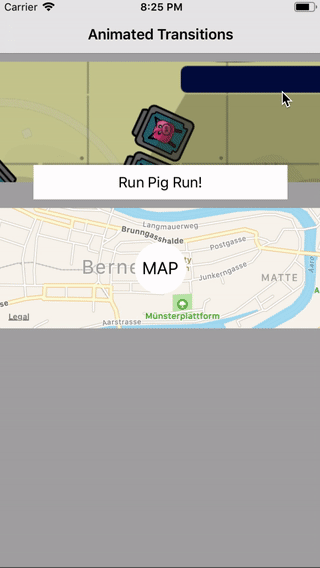

# AnimatedTransition

<table>
<tr>
<td></td>
</tr>
</table>

## How to use?
1. Present view controller modally 
2. Set `transitioningDelegate`

3. Implement `AlphaTransitionPresenter` for your first ViewController
4. Implement `AlphaTransitionPresentable` for your second ViewController

`AlphaTransition` will check this protocols and start present or dismiss animator otherwise you will see default animations.